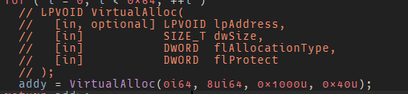
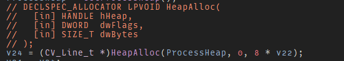

# Commentator - MSDN annotations

## Overview

Commentator is a [IDA Pro](https://www.hex-rays.com/products/ida/) plugin for annotating decompiler output with the
function prototype of the winapi function just so its easier to focus.

## Installation

1. From your disassembler's python console, run the following command to find its plugin directory:
    - **IDA Pro**: `os.path.join(idaapi.get_user_idadir(), "plugins")`

2. Copy `commentator.py` and `commentator.db` to the listed directory
3. Restart IDA.

This plugin assumes you have python3

# Usage
## Usage

Put the cursor to the function call which you want to annotation for and press `Ctrl-Alt-S`, every call for that
function in that idb is annotated

## Screenshot

*note: these screenshots are from the other branch*

## TODO
- Add scripts and steps to generate `commentator.db` by parsing local documentation from msdn
- Fix stuff in the `blkcmnt` branch and merge it to main

## Thanks

- [mrexodia](https://github.com/mrexodia)